### Build

Run `cargo +nightly build --release`  
Then run `./target/release/dora-moloch --dev`

### Test

1. Navigate to https://polkadot.js.org/apps/#/explorer, and  copy the [types.json](../pallets/moloch-v2/src/types.json) to settings->developer then save
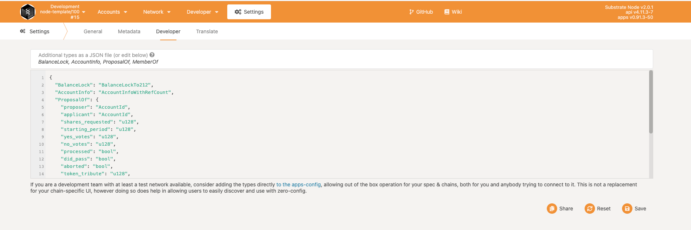
2. Click the lef top icon to open settings and choose the custom node and input `wss://moloch-v2.tophacker.com/`, just like below
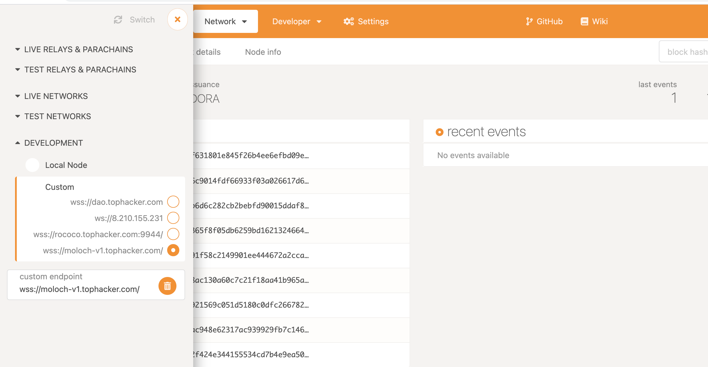
Or if you want to test on your local machine, ust choose local node.
3. `summon`, this is to set up initial configuration for your moloch DAO.  
- period_duration, timing unit in seconds, for test you can set it to 120.  
- voting_period_length, number of periods for voting, after that you can not vote anymore.  
- grace_period_length, number of periods for silencing next behind voting, in case any member `ragequit`.  
- proposal_deposit, tokens to deposit when member proposed a proposal.
- proposal_reward, tokens will be distributed to anyone processed a proposal, this will be deducted from proposer's deposit, so it's NOT greater than proposal_deposit
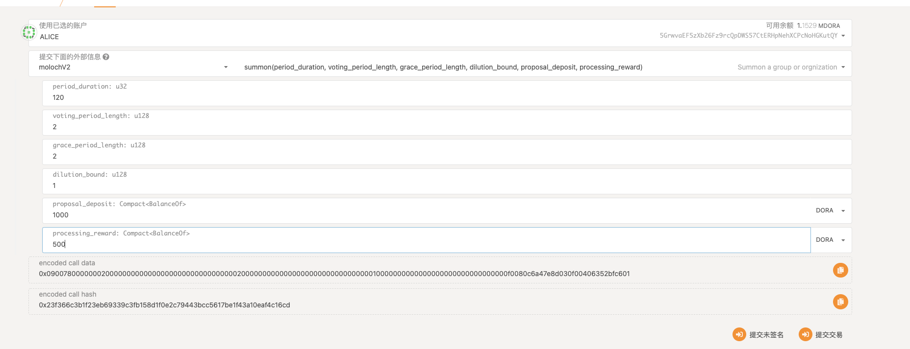

4. `submit_proposal`, propose a proposal, define the shares and tribute. The proposal can be requesting shares or loot, or get payed from the pool
- tribute_offered, amount of token desposit in custody account, which will be transfered into GuildBank if proposal gets passed.
- shares_requested, shares to mint.
- loot_requested, loot to mint.
- payment_requested, amount of token will be transfered to the applicant.
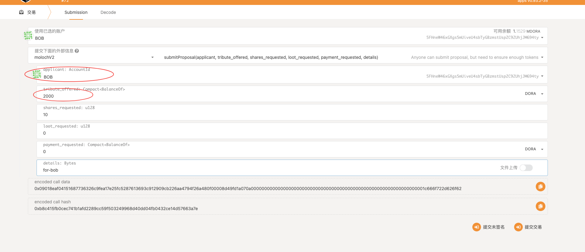

5. `sponsor_proposal`, a member sponsor some proposal, only sponsored proposals can be voted.
- proposal_index, the index of proposal queque
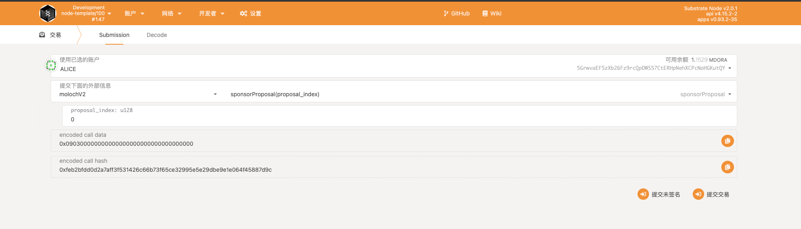

6. `submit_vote`, only member can vote a YES/NO to a proposal.
- proposal_index, the index of proposal queque
- vote, 1/2 means YES/NO, other inputs are not valid  
After proposal submitted, you can use member to vote. As long as it's still in voting period.
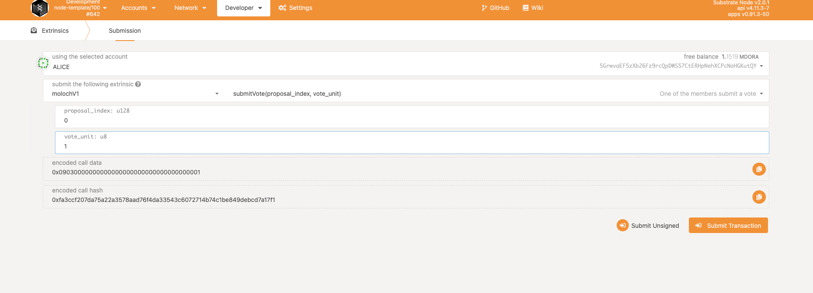
You can check that proposals have been update.
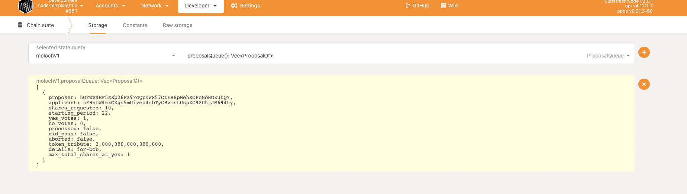

7. `process_proposal`, anyone can process a proposal, after passing grace period. No matter the proprosal passed or not the processor will get reward, which is a global constant.
- proposal_index, the index of proposal queque
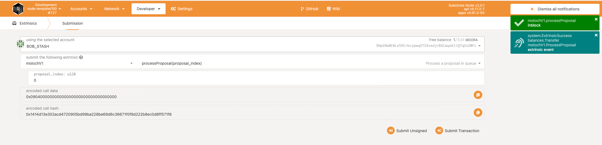
After processing, Bob will become a member and Bob_Stash's balance increased 500 `DORA` which is just the amount of processing_reward.
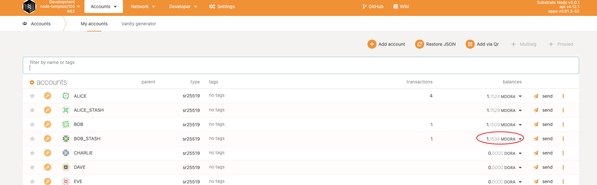
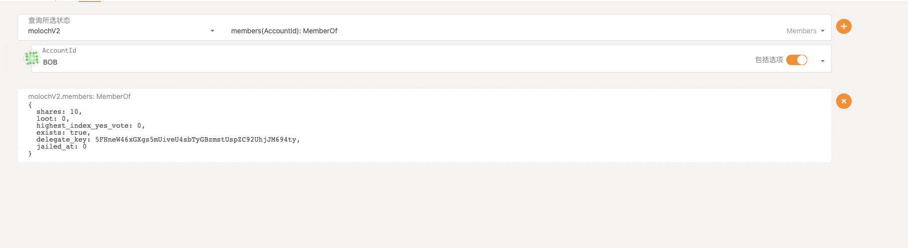

8. `abort`, the applicant can abort a proposal which is not sponsored yet.
- proposal_index, the index of proposal queque
We can use another account to custody some tokens and then ask member to propose. But this time, after submitted, we use this applicant to abort. In this way, we'll see applicant's balance remain the same, but member's deposit will NOT be returned.
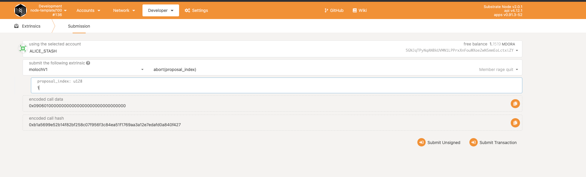
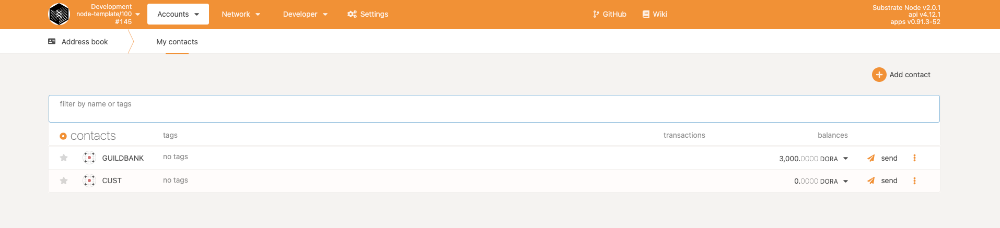

9. `guild_kick`, someone can propose to kick some member, for this kind of proposal.
- member_to_kick, the member to be kicked.
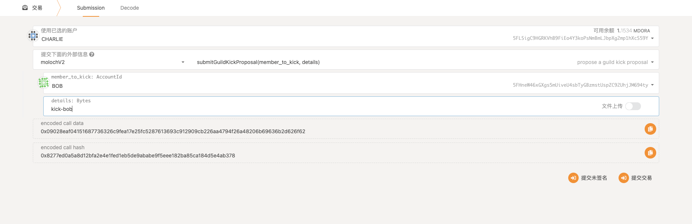
After members voted and passed, the kicked member become in jailed. Although the member's still in group, but anyone can use `rage_kick` to remove him.
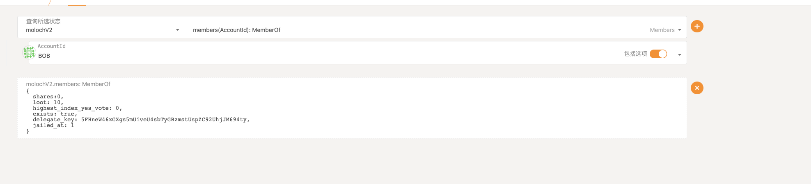